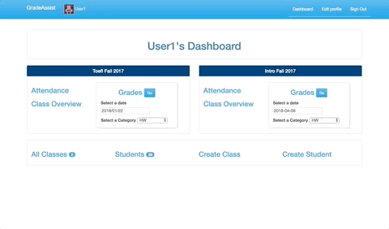

# GradeAssist
#### Making grading easier and more efficient so teachers can focus on helping students learn.

This simple grading app was developed to help teachers at a local community college. Grade and attendance recording and reporting takes too much time away from teaching. GradeAssist reduces the amount of time it takes to record grades by 50%, so teachers can get back to teaching!

Try it out here: [GradeAssist](http://gradeassist2.herokuapp.com/)

## Features

+ Current classes are displayed on the **Teacher Dashboard**
+ Attendance and other grade category links on the dashboard provide easy access
+ Grade categories and their weights are dynamic, meaning you can set as many as you want
+ The **Class Overview** page displays attendance and grade percentages for each student
+ Detailed grades listed by date are provided for each student
+ Download a spreadsheet (.xls) file of grades to ease reporting

## Getting Started
This application was built with `Ruby 2.4` and `Rails 4.2.8`.

### System Dependencies
+ Devise is used for user authentication.
+ Simple Form
+ Cocoon
+ Best In Place
+ Bootstrap-Datepicker-Rails
+ AXLSX
+ Simple Calendar

### Installing
In order to install **GradeAssist** locally:
1. Clone or download this repository
2. Run `bundle install` to install dependencies
3. Run `rake db:create` and `rake db:migrate` to setup the database
4. Run `rails s` and navigate to `localhost:3000` to use in your browser

## Author
Created by [Scott Lenander](http://scottlenander.com/)
